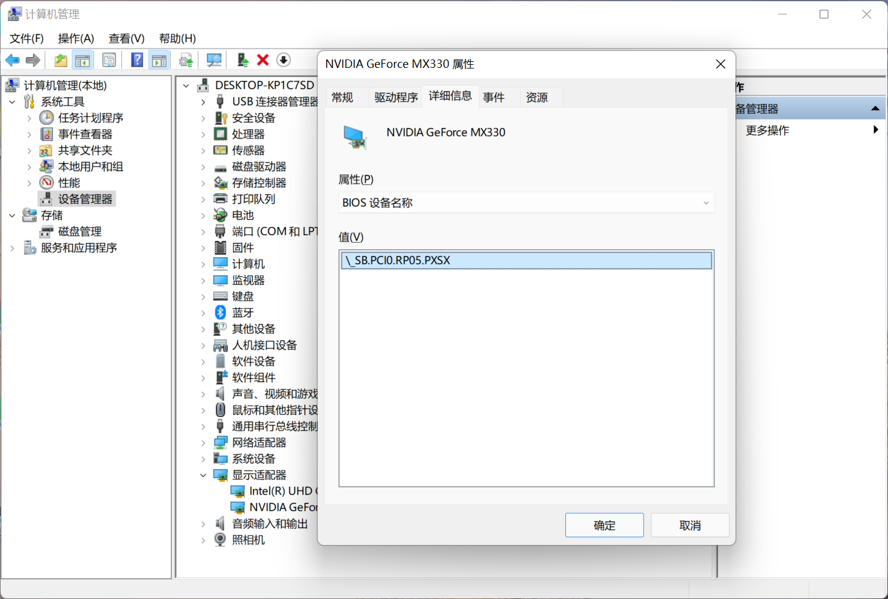

# Dell Inspiron 5401 (Ice Lake) Hackintosh

EFI exclusively for Dell Inspiron 5401 with OpenCore bootloader(If your computer is not Inspiron 5401, then please go to [Lorys89's repository](https://github.com/Lorys89/DELL_VOSTRO_5401-ICE-LAKE) and use the universal one)

## Computer Spec:

| Component        | Brank                              |
| ---------------- | ---------------------------------- |
| CPU              | Intel i5 1035G1 (4C-8T)            |
| iGPU             | Intel? Iris Plus Graphics          |
| Audio            | Realtek High Definition Audio      |
| Ram              | 8 GB DDR4 3200 Mhz                 |
| Wifi + Bluetooth | BCM94352Z (DW1560)                 |
| NVMe             | KIOXIA KBG40ZNS512G 512 GB (WINDOWS)       |
| NVME             | SAMSUNG 970 EVO PLUS 500 GB (MACOS)|
| SmBios           | MacBookPro 16,2                    |
| BootLoader       | OpenCore 0.7.6                     |
| macOS            | Monterey 12.0.1                    |

## Notice:

- Usb port mapping may need to redo (camera may not working if not redo)
- SSDT-dGPU-Off need to be changed.([fullversion](https://dortania.github.io/Getting-Started-With-ACPI/Desktops/desktop-disable.html#finding-the-acpi-path-of-the-gpu))

## Credits:
- [Apple](https://apple.com) for macOS.
- [Lorys89](https://github.com/Lorys89/DELL_VOSTRO_5401-ICE-LAKE) for the universal EFI
- [Dortania](https://dortania.github.io/Getting-Started-With-ACPI/Desktops/desktop-disable.html#finding-the-acpi-path-of-the-gpu) for excellent guide

